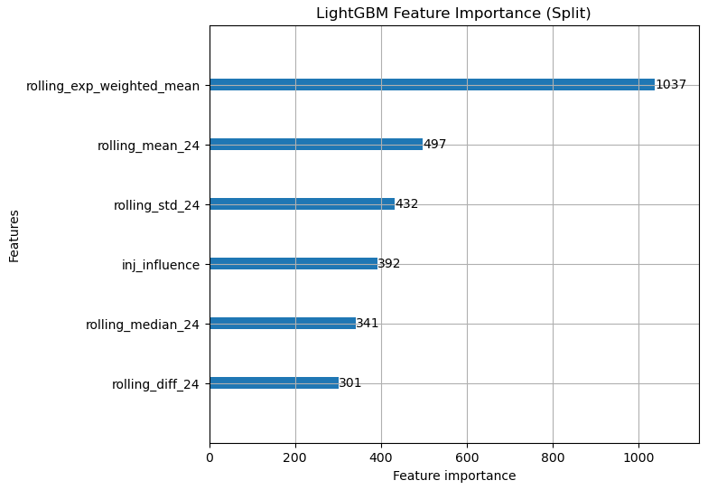
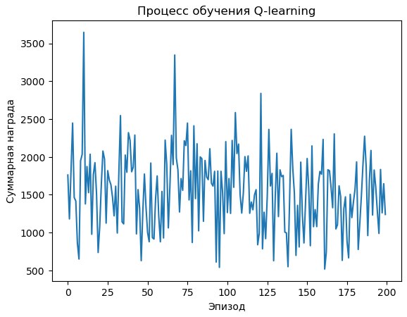
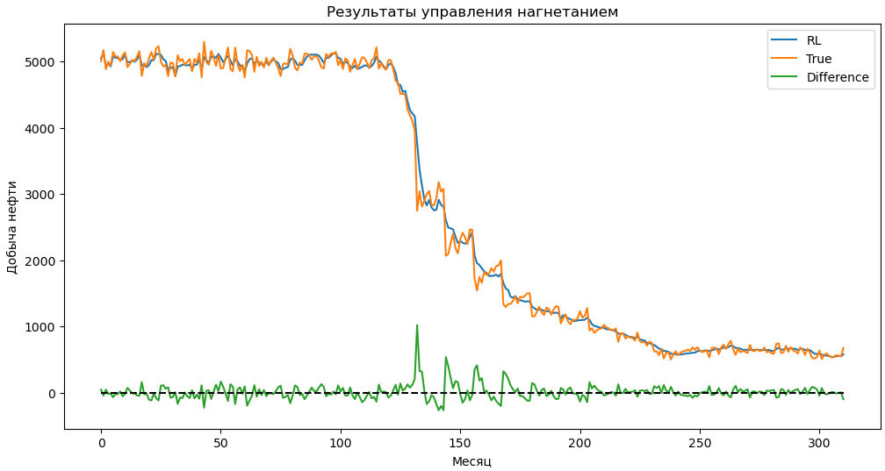
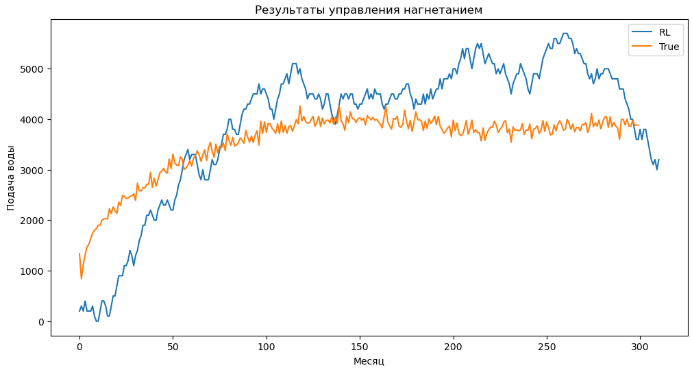

RL in time series
=================

Application of Reinforcement Learning methods for time series forecasting

Links to Data
-------------

Groningen data - https://www.nlog.nl/en/data (Boreholes, Wells) ` `
Volve data - https://www.equinor.com/energy/volve-data-sharing ` `
COSTA data - https://researchportal.hw.ac.uk/en/datasets/costa-model-hierarchical-carbonate-reservoir-benchmarking-case-st

## Data preparation

На данный момент модель готова для датасета  COSTA

В датасете выделены следующие фичи:

1. Скользящее среднее по добыче газа
2. Скользящее стандартное отклонение по добыче газа
3. Скользящая медиана по добыче газа
4. Скользящая разность по добыче газа
5. Скользящее экспоненциально взвешенное срезднее по добыче газа
6. **Признак влияния нагнетательных скважин**
   рассчитан как: для добывающей скважины это сумма отношений нагнетаемой воды к расстоянию до добывающей скважины по всем INJ скважинам

## Архитектура модели

RL агент - модель на основе q-learning'а, которая контролирует подачу воды в каждой нагнетательной скважине.

Цель - повысить добычу нефти

Основная сложность - наличие только исторических данных, а для обучения RL агента необходима симуляция, которая дает награду в зависимости от результата его действий

Решение - вспомогательная модель ("rewarder"), которая предсказывает добычу нефти для предложенного RL агентом нагнетания. На основе предсказанной добычи рассчитывается награда = (предсказанная добыча - реальная добыча)

### Вспомогательная модель

Модель градиентного бустинга LightGBM.

Обучена на всем датасете (все даты, все добывающие скважины, фичи указаны выше)

Feature_importance:

### Основная модель

RL модель на основе q-lerning'а

Доступные дискретные действия агента:

* Нагнетание +200
* Нагнетание +100
* Нагнетание +0
* Нагнетание -100
* Нагнетание -200

На каждом шаге (каждая строка данных - каждый месяц в датасете COSTA) агент совершает одно из доступных действий для каждой скважины **по отдельности**

Нагнетание на каждой скважине ограничено 0 снизу, сверху не ограничено

Если в данный месяц агент (согасно предсказанию вспомогательной модели) добыл нефти больше, чем добыто в реальности, получает награду равную алпифту добычи, иначе штрафуется аналогичным образом

Обучение идет только на одной добывающей скважине, множество раз

## Результаты после 200 эпизодов обучения

По оси х - эпизод обучения
По оси у - суммарная награда за весь эпизод (на столько больше нефти добыл агент по сравнению с историческими данными)

Можно видеть, что агент всегда добывает больше нефти, чем было добыто в реальности, это настораживает, подробнее об этом в выводах

**График добычи для последнего эпизода**

По оси x - месяц
По оси у - добыча нефти

Синяя линия - RL агент
Оранжевая линия - реальная добыча (True)
Зеленая линия - разница RL и True

Добыча нефти за 311 месяцев: 857515.53 (True) vs 860573.73 (RL)
Разница: +3058.20

Можно видеть, что добыча агента и реальная почти не отличаются, причем добыча агента похожа на простое предсказание вспомогательной модели на исторических данных.

**График нагнетания на одной из скважин**

По оси х - месяц
По оси у - нагнетание

Синяя линия - нагнетание на скважине, управляемой RL агентом
Оранжевая линия - нагнетание на этой же скважине в реальности

Можно видеть, что агент в результате обучения в целом улавливает динамику необходимого нагнетания.

Причем, нагнетание при этом не растет в бесконечность, а колеблется вокруг плато около 4000-5000

## Выводы

По графикам можно сделать следующие выводы:

1. Агент научился имитировать реальное нагнетание, что говорит о применимости метода q-обучения в данной задаче
2. Uplift скорее похож на погрешность вспомогательной модели, чем на реальное повышение добычи, это, по нашему мнению, связано с плохой вспомогательной моделью.
   Есть гипотеза, что это может быть вызвано ее деревянной архитектурой, она не дает агенту выйти за стандартный паттерн, который выявила в ходе своего обучения.
   Так же, возможно имеет место быть переобучение вспомогательной модели из-за того, что она обучалась на всех скважинах, а не только на одной, как агент.

## Планы на будущее

**В рамках НИР**

* Протестить линейную регрессию и нейросеть в качестве вспомогательной модели, чтобы избавиться от недостатков деревянных моделей
* Увеличить число эпизодов обучения

**В рамках дипломной работы**

* Изменить простое q-обучение на глубокое
* Добавить возможность агенту совершать не дискретные, а непрерывные действия (решается глубокой моделью)
* Сравнить различные архитектуры нейросетей в глубоком q-обучении (MLP, CNN, LSTM)
* Расширить модель на все скважины
* Построить модели для других датасетов: Groninen, Volve, ITMO

Project Organization
--------------------

    ├── LICENSE
    ├── Makefile           <- Makefile with commands like`make data` or `make train`
    ├── README.md          <- The top-level README for developers using this project.
    ├── data
    │   ├── external       <- Data from third party sources.
    │   ├── interim        <- Intermediate data that has been transformed.
    │   ├── processed      <- The final, canonical data sets for modeling.
    │   └── raw            <- The original, immutable data dump.
    │
    ├── docs               <- A default Sphinx project; see sphinx-doc.org for details
    │
    ├── models             <- Trained and serialized models, model predictions, or model summaries
    │
    ├── notebooks          <- Jupyter notebooks. Naming convention is a number (for ordering),
    │                         the creator's initials, and a short `-` delimited description, e.g.
    │                         `1.0-jqp-initial-data-exploration`.
    │
    ├── references         <- Data dictionaries, manuals, and all other explanatory materials.
    │
    ├── reports            <- Generated analysis as HTML, PDF, LaTeX, etc.
    │   └── figures        <- Generated graphics and figures to be used in reporting
    │
    ├── requirements.txt   <- The requirements file for reproducing the analysis environment, e.g.
    │                         generated with `pip freeze > requirements.txt`
    │
    ├── setup.py           <- makes project pip installable (pip install -e .) so src can be imported
    ├── src                <- Source code for use in this project.
    │   ├── __init__.py    <- Makes src a Python module
    │   │
    │   ├── data           <- Scripts to download or generate data
    │   │   └── make_dataset.py
    │   │
    │   ├── features       <- Scripts to turn raw data into features for modeling
    │   │   └── build_features.py
    │   │
    │   ├── models         <- Scripts to train models and then use trained models to make
    │   │   │                 predictions
    │   │   ├── predict_model.py
    │   │   └── train_model.py
    │   │
    │   └── visualization  <- Scripts to create exploratory and results oriented visualizations
    │       └── visualize.py
    │
    └── tox.ini            <- tox file with settings for running tox; see tox.readthedocs.io

---

<small>Project based on the <a target="_blank" href="https://drivendata.github.io/cookiecutter-data-science/">cookiecutter data science project template</a>. #cookiecutterdatascience</small>

